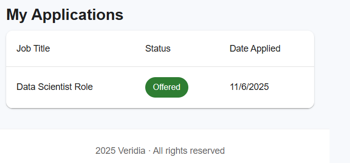
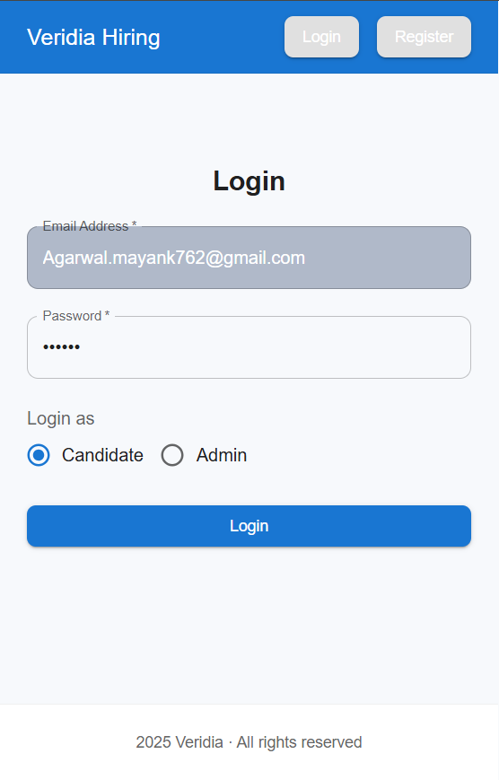
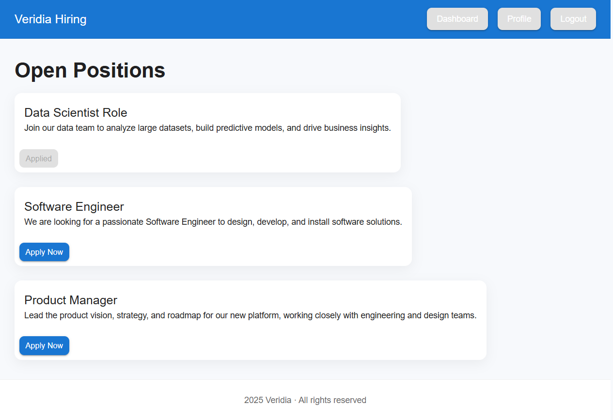
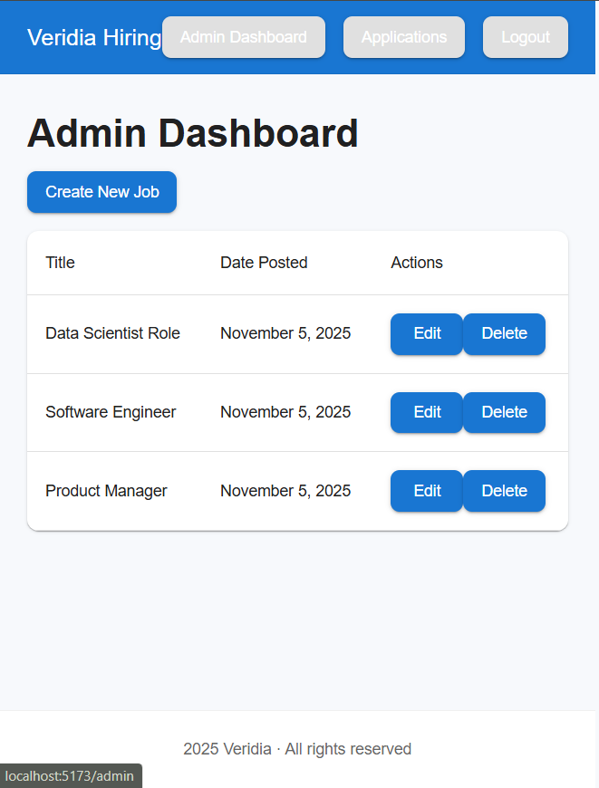
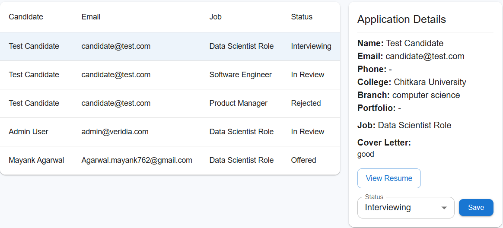
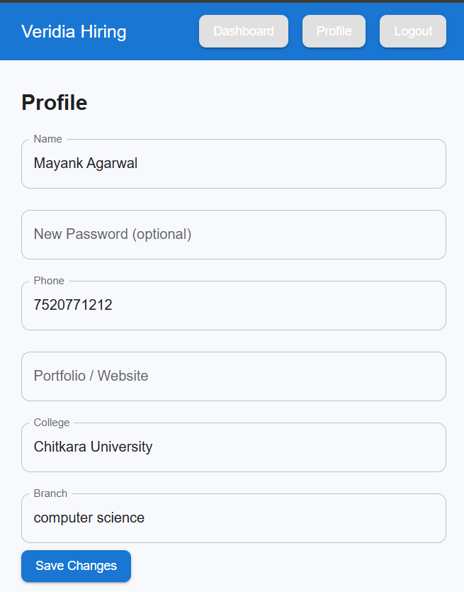
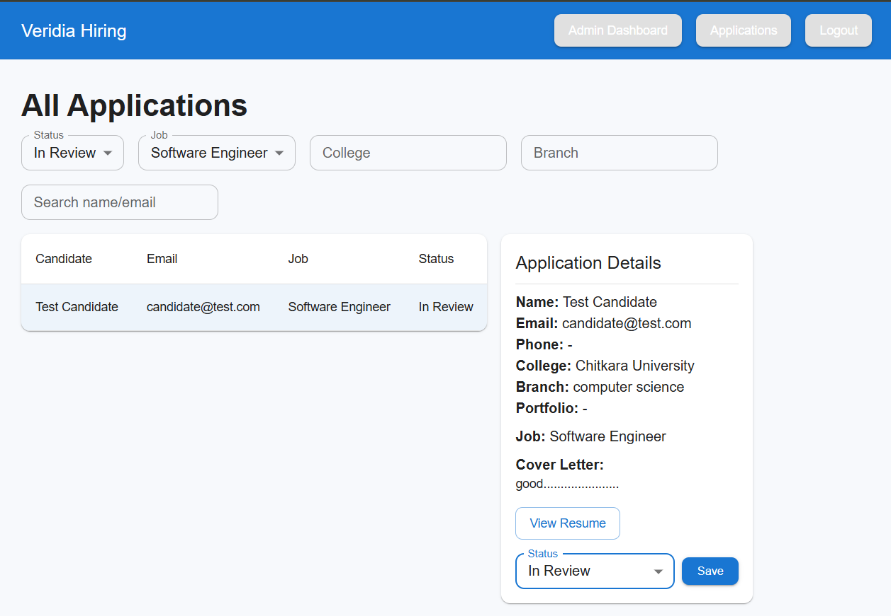

# Veridia Hiring Platform

This is a full-stack hiring platform designed to streamline and professionalize the recruitment process at Veridia. It replaces the previous system of using Google Forms with a dedicated, feature-rich application.

## Features Implemented

- **Candidate Registration and Login**: Candidates can create an account and log in securely.
- **Admin Registration and Login**: A separate registration and login system for the HR team.
- **Job Listings**: Publicly visible list of all open job positions.
- **Application Form**: Candidates can apply for jobs by uploading their resume and a cover letter.
- **Candidate Dashboard**: Authenticated candidates can view a list of their submitted applications and track their status.
- **Admin Dashboard**: A comprehensive dashboard for the HR team to:
  - Create, edit, and delete job postings.
  - View all applications submitted for a specific job.
  - Update the status of each application (e.g., 'In Review', 'Interviewing', 'Rejected').
- **Automated Email Notifications**: 
  - Candidates receive an email confirmation upon submitting an application.
  - Candidates are notified when the status of their application is updated by an admin.
  - Admins are notified when a new application is submitted.
- **Secure & Private Routes**: The application uses JWT authentication to protect sensitive routes and data.

## Tech Stack

### Backend

- **Runtime**: Node.js
- **Framework**: Express.js
- **Database**: MongoDB with Mongoose for object data modeling.
- **Authentication**: JSON Web Tokens (JWT)
- **Password Hashing**: bcrypt.js
- **File Uploads**: Multer
- **Email Notifications**: Nodemailer

### Frontend

- **Framework**: React (with Vite)
- **UI Library**: Material-UI (`@mui/material`)
- **Routing**: React Router (`react-router-dom`)
- **HTTP Client**: Axios
- **Form Management**: Formik
- **Validation**: Yup
- **Styling**: Tailwind CSS (and Emotion with MUI)

## Getting Started

To get a local copy up and running, follow these simple steps.

### Prerequisites

- Node.js and npm (or yarn)
- MongoDB (local instance or a MongoDB Atlas cluster)

### Installation & Setup

1. **Clone the repository:**
   ```sh
   git clone (repository link)
   cd veridia-hiring-platform
   ```

2. **Set up the Backend:**
   - Navigate to the `backend` directory: `cd backend`
   - Install dependencies: `npm install`
   - Create a `.env` file in the root of the project and add the following environment variables:
     ```
     MONGODB_URI=your_mongodb_connection_string
     JWT_SECRET=your_jwt_secret
     EMAIL_USER=your_gmail_address
     EMAIL_PASS=your_gmail_app_password
     PORT=5000
     ```

3. **Set up the Frontend:**
   - Navigate to the `frontend` directory: `cd ../frontend`
   - Install dependencies: `npm install`

### Running the Application

1. **Start the Backend Server:**
   - From the `backend` directory, run: `npm start`
   - The server will start on `http://localhost:5000`.

2. **Start the Frontend Development Server:**
   - From the `frontend` directory, run: `npm run dev`
   - The application will be available at `http://localhost:5173` (or another port if 5173 is in use).

## Screenshots

### Home Page



### Login Page



### Candidate Dashboard



### Admin Dashboard



### Applications (Admin)



### Profile (Candidate)



### Admin Applications (Filters & Detail)



## License

This project is for demonstration and hiring evaluation purposes at Veridia.
